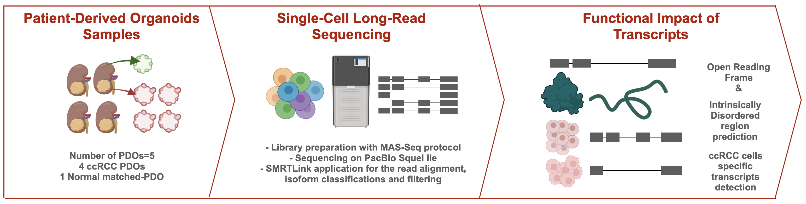

# Single-cell Long-read Sequencing of Patient-Derived ccRCC Organoids
This repository has the files and codes to analyze the single-cell long-read RNA sequencing data of the paper: Heterogeneous and Novel Transcript Expression in Single Cells of Patient-Derived ccRCC Organoids 

